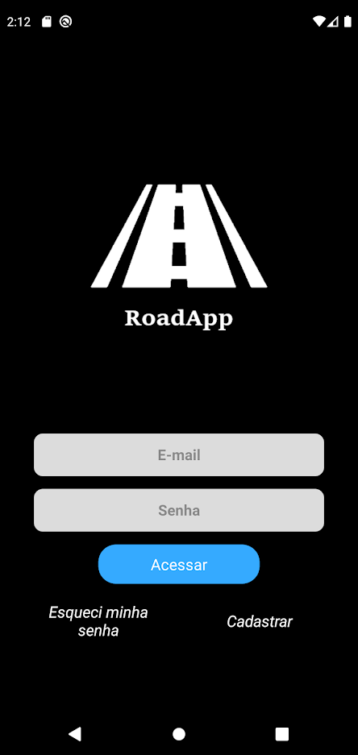
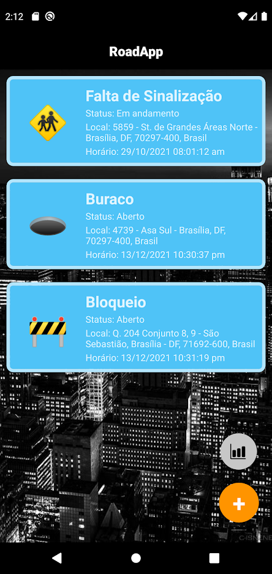
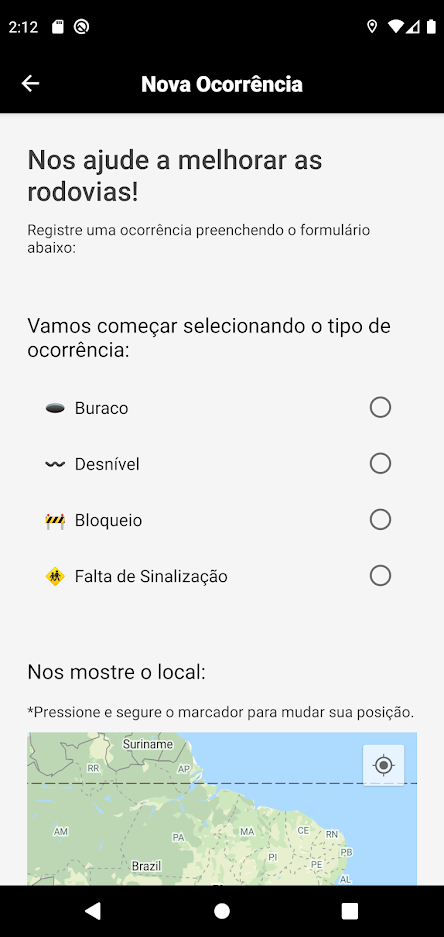
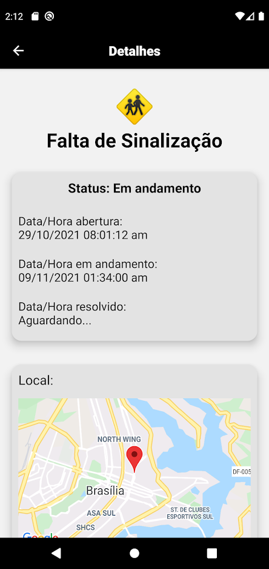

# RoadApp_udf
## Aplicativo mobile Android - TCC Sistemas de Informação (UDF)

Aplicativo desenvolvido utilizando React Native integrado ao banco de dados Firebase.

O app foi arquitetado como Trabalho de Conclusão de Curso para o curso de Sistemas de Informação do UDF - Centro Universitário do Distrito Federal em 2021.

A principal funcionalidade do aplicativo foi planejada para ser a disponibilização de um sistema onde as pessoas 
pudessem registrar ocorrências de problemas existentes em estradas e rodovias do país. Como, por exemplo, **buracos**, **desníveis**, **bloqueios** e **sinalizações quebradas**.

## Imagens

  
  
  
  

## Requisitos para rodar a aplicação

Como o código foi desenvolvido no formato CLI do React Native, é necessário possuir tanto o framework como o emulador instalados na máquina.

- React Native -> [Site](https://reactnative.dev/docs/environment-setup)

- Android Studio -> [Site](https://developer.android.com/studio)

## Restaurar dependencias

Será necessária a restauração das bibliotecas utilizadas na aplicação.

## Inserir seu banco de dados

Por fim, será necessário adicionar nos arquivos abaixo as respectivas Firebase DataBase Key e Google API Key

src/firebaseConnection.js

src/screens/NovaOcorrencia/index.js
